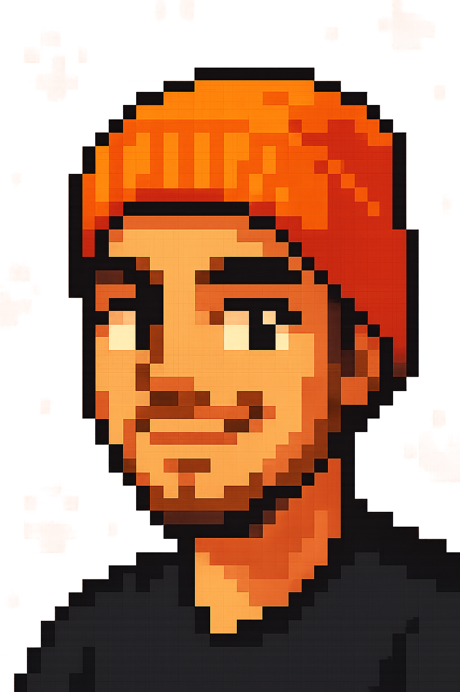

<h1 align="center"> Hola, soy Fabian Guerrero </h1>

<!-- Sobre mi -->
<h3>Sobre mí</h3>

👋 ¡Hola! Soy <strong>Fabian Guerrero</strong>, también conocido como FXGCode. Soy un Desarrollador de Software Full Stack con experiencia en <strong>Node.js, MongoDB, Firebase, HTML, CSS, JavaScript, Python, React, Flutter y Android</strong>. Me apasiona la tecnología y disfruto creando aplicaciones web y móviles que faciliten la vida de las personas.

 

Siempre busco innovar y mejorar mis habilidades, enfrentando nuevos desafíos y explorando las últimas tendencias en desarrollo. Mi enfoque es transformar ideas en soluciones eficientes y escalables.

 

Si necesitas una web, aplicación o sistema a medida, estaré encantado de ayudarte a llevar tu proyecto al siguiente nivel. 🚀💻

 

📩 Contáctame y hagamos realidad tu idea.

<!-- Insignia de recuento de perfiles -->

  

<!-- Lᴀɴɢᴜᴀɢᴇs ᴀɴᴅ Tᴏᴏʟs -->

### Mis trofeos de GitHub  

